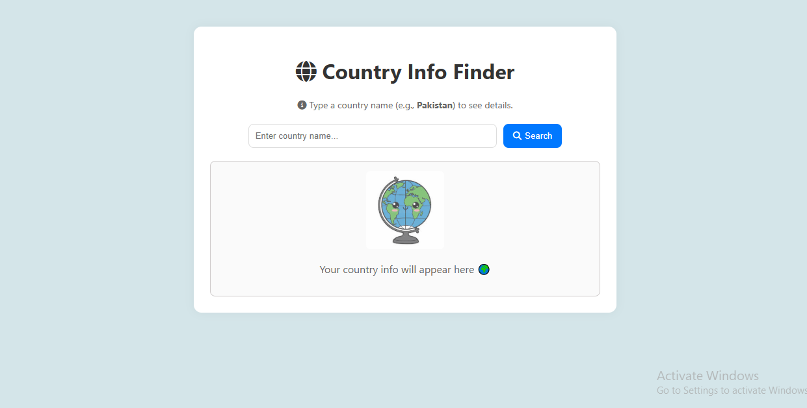
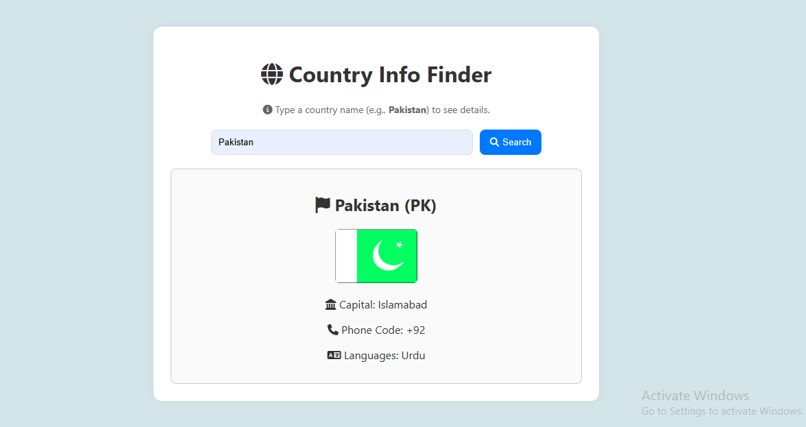

# 🌍 Country Info Finder

A simple and interactive web application that allows users to search for a country by name and view key details such as:

- 🇺🇳 **ISO Code**
- 🏛 **Capital City**
- 📞 **Phone Code**
- 🏴 **Flag**
- 🗣 **Languages**

This project uses a **SOAP-based Country Info Web Service** via a CORS proxy.

---

## 📸 Preview





---

## 🚀 Features

- 🔍 Search any country by name  
- 📡 Fetch country details using **SOAP API**  
- 🎨 Clean and responsive UI  
- ⚡ Instant results with loading animation  
- 🖼 Displays flag and other details clearly  

---

## 🛠 Technologies Used

- **HTML5**
- **CSS3**
- **JavaScript (Vanilla JS)**
- **Font Awesome Icons**
- **SOAP Web Service**:  
  [CountryInfoService.wso](http://webservices.oorsprong.org/websamples.countryinfo/CountryInfoService.wso)  
- **CORS Proxy**: [corsproxy.io](https://corsproxy.io/)

---

## 📂 Project Structure

Country-Info-Finder/
│── index.html # Main HTML file
│── style.css # Styling
│── script.js # SOAP API logic
│── images/ # Image assets
│ ├── globe.png
│ ├── preview.png
│── README.md # Documentation

---

## ⚙️ Installation & Usage

1. **Clone this repository**
   ```bash
   git clone https://github.com/yourusername/country-info-finder.git
Navigate to the project folder
cd country-info-finder
Open index.html in your browser
You can double-click it or use:
start index.html    # Windows
open index.html     # macOS


## 🔑 API Details
The app uses SOAP requests to fetch:

CountryISOCode

FullCountryInfo

CountryIntPhoneCode

A CORS proxy (https://corsproxy.io/?) is used to avoid browser CORS restrictions.
